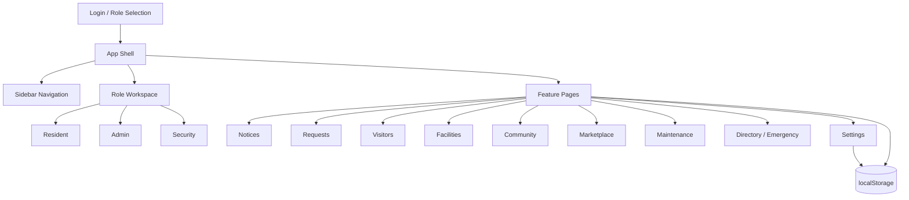
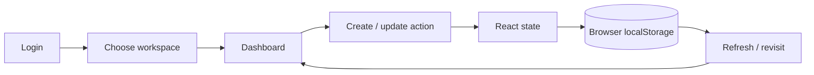

# Nestly — Smart Residential Community Platform

Nestly is a polished React + TypeScript community management web application for residents, administrators and security teams. It demonstrates complete, interactive workflows rather than static screens.

## Features
- Role-based Resident / Admin / Security workspaces
- Digital notice board and announcements
- Service request creation, assignment and resolution
- Visitor pass creation and security verification with entry logs
- Facility booking interactions
- Community posts and event participation
- Buy / Sell / Rent marketplace listings
- Maintenance payment demo workflow
- Resident directory and emergency contacts
- Notifications, profile modal and settings
- Local browser persistence for demo data
- Loading state and error-boundary recovery screen
- Responsive glassmorphism / 3D visual design

## Tech stack
- React 18
- TypeScript
- Vite
- React Router
- Lucide React icons
- Browser localStorage for demo persistence

## Architecture


## Application flow


## Project structure
```text
nestly/
├── public/
├── src/
│   ├── App.tsx        # application shell, pages and workflows
│   ├── main.tsx       # React bootstrap + error boundary
│   └── styles.css     # responsive visual system
├── package.json
└── README.md
```

## Setup
```bash
npm install
npm run dev
```
Then open the Vite development URL shown in the terminal.

## Demo behavior
This submission intentionally uses local mock data so it can be evaluated without a backend account. Creating requests, visitor passes, bookings, posts, listings and announcements updates the interface immediately and persists the demo state in the browser.

Use **Settings → Reset demo data** to restore the initial state.

## Reliability states
- Initial workspace loading screen
- Empty states for queues/lists
- Form validation feedback
- Error boundary with retry action
- Local persistence fallback when browser storage is unavailable

## Limitations
- Authentication is a front-end demonstration, not production identity management.
- No real payment gateway is connected.
- Visitor QR codes and emergency calls are demo interactions.
- Data is stored in browser localStorage rather than a shared server database.

## Future improvements
- Firebase / Supabase authentication and database
- Real QR generation and gate scanning
- Push notifications
- Online payment gateway
- Cloud file/image uploads
- Audit logs and advanced admin analytics
- Automated tests and CI/CD

## GitHub commit suggestion
For evaluation, keep the repository history meaningful rather than using one final commit. Suggested commits:
1. `feat: create responsive Nestly application shell`
2. `feat: add role based community dashboards`
3. `feat: connect interactive community workflows`
4. `feat: add admin and security operations`
5. `feat: add local persistence and reliability states`
6. `docs: add architecture and application flow`

## SQL Backend (Phase 11)

Nestly now includes a separate `backend/` implementation using **MySQL + Node.js + Express**. The SQL schema covers users/roles, notices, events, service requests, visitor passes, facilities/bookings, community posts, marketplace listings, maintenance payments, emergency contacts, notifications, and security entry logs.

The browser should communicate with MySQL only through the REST API in `backend/server.js`; it should never connect directly to the database.

See `backend/README.md`, `backend/schema.sql`, `backend/seed.sql`, and `backend/.env.example` for setup.
